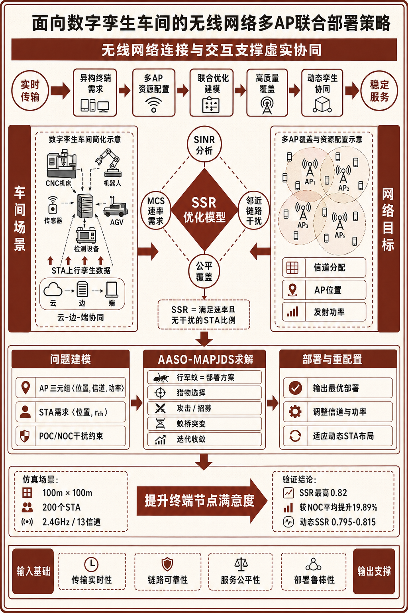
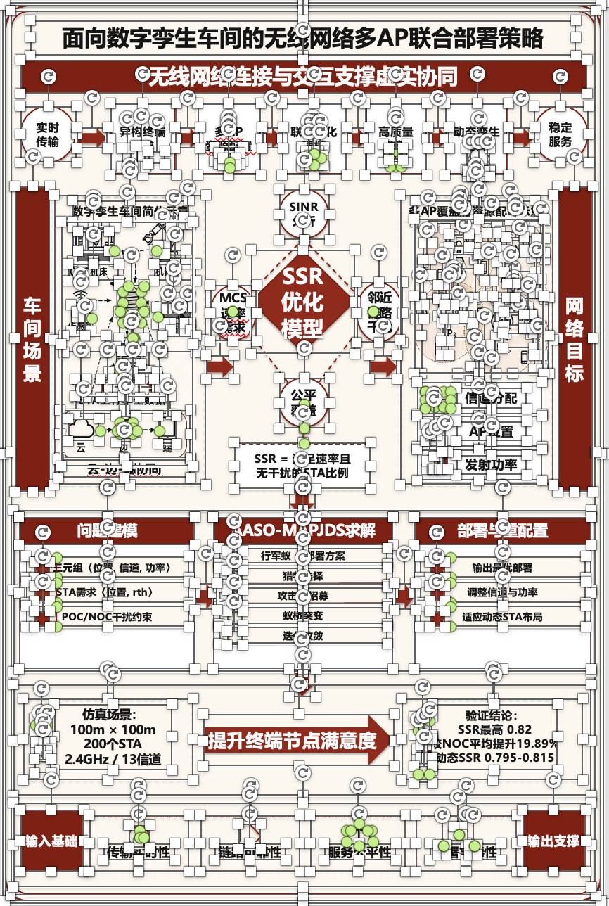
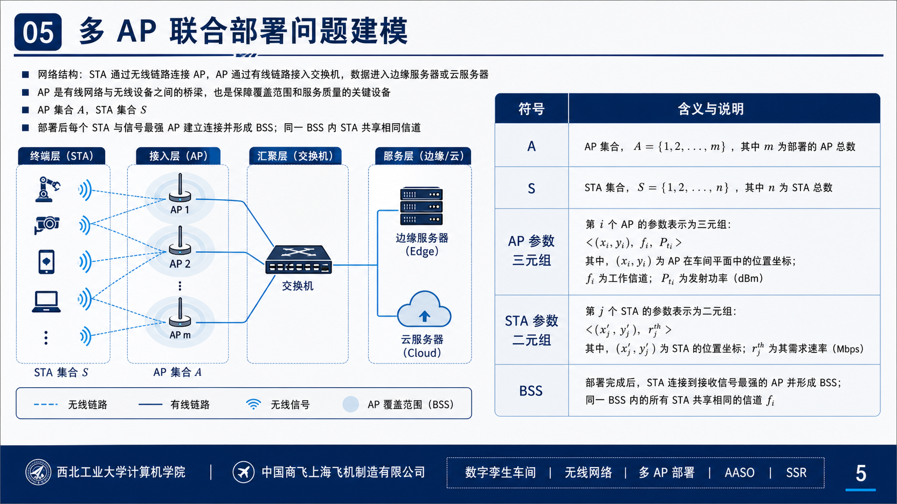
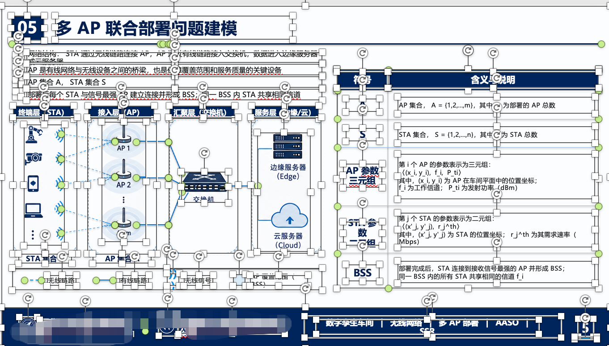
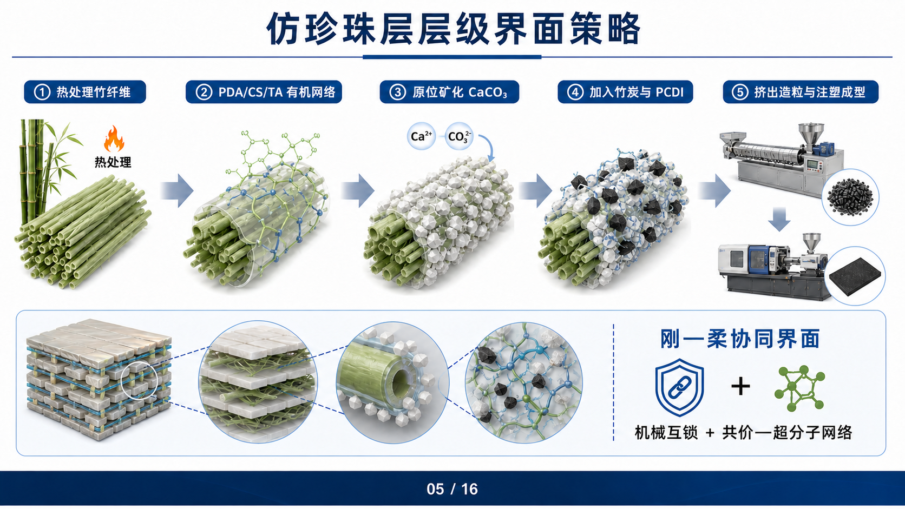
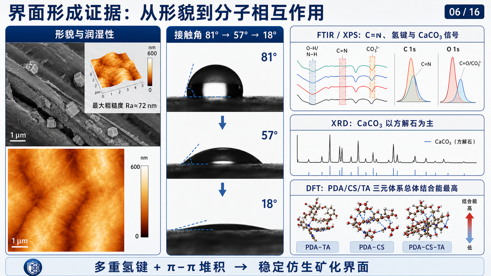
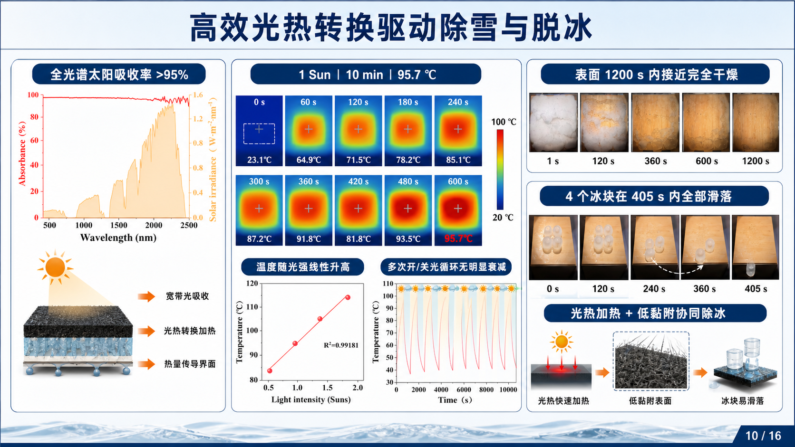
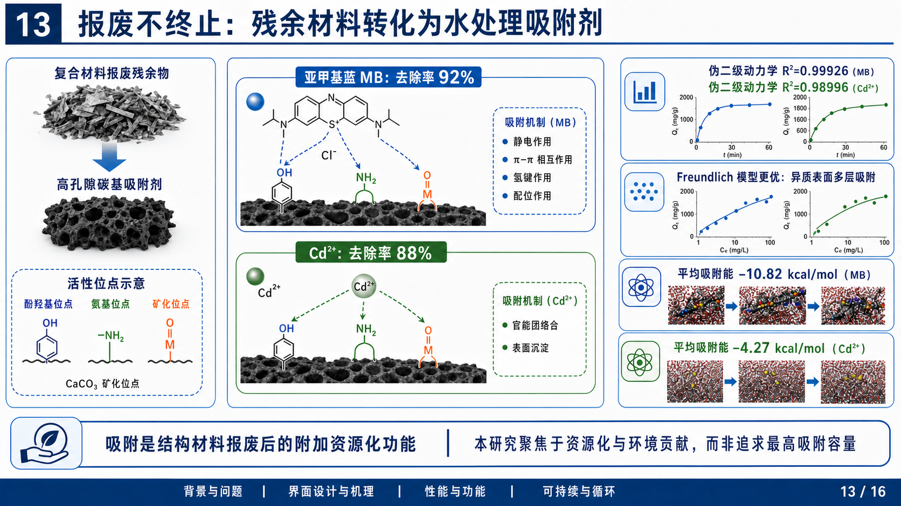
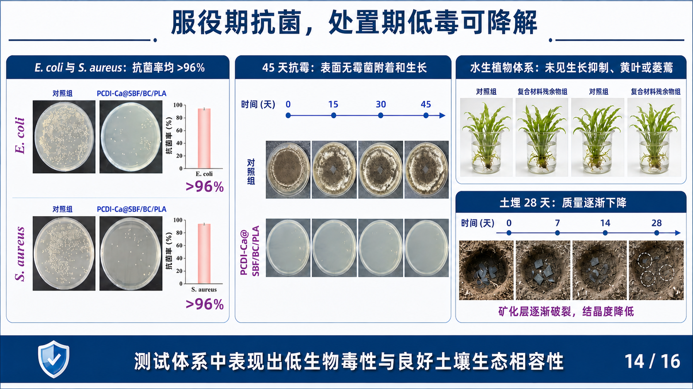

# 小北在读研 · XiaoBei Skills

大家好，我是**小北在读研**，研二在读，电子信息专业。目前主要做 **AI + 科研**、**Agent 赋能科研工作流** 相关内容。全网10w➕粉丝，感兴趣的朋友也可以关注一下我的抖音：小北在读研

长期分享科研工具、论文阅读、学术绘图、科研 Agent、AI 自动化和研究生提效方法。除了这个开源 skill，我还在维护个人学术网站 [xiaobeiai.top](https://xiaobeiai.top) 和科研 API 中转站 [beiapi.cn](https://beiapi.cn)。

## 加入科研 AI 交流

如果你是硕士、博士、科研工作者，或者正在做论文、课题、学术绘图、科研自动化、Agent 工作流，欢迎加我微信交流。

<table>
  <tr>
    <td width="46%" valign="top">
      <h3>和小北一起做 AI + 科研</h3>
      <p>适合硕博生、科研工作者、论文写作者、科研工具爱好者。</p>
      <p>交流方向：科研 Agent / 学术绘图 / 论文工作流 / API 工具 / 研究生提效。</p>
      <p><strong>加好友建议备注：</strong><br><code>GitHub + 学校/方向 + 年级</code></p>
      <p>例如：<code>GitHub + 电子信息 + 研二</code></p>
    </td>
    <td width="54%" align="center" valign="middle">
      
    </td>
  </tr>
</table>

你也可以通过这些入口了解我正在做的东西：

- 个人学术网站：[xiaobeiai.top](https://xiaobeiai.top)
- 科研 API 中转站：[beiapi.cn](https://beiapi.cn)
- 内容方向：AI + 科研、Agent 赋能科研、研究生提效、学术绘图、论文工作流

## 开源 Skill 合集

这里集中维护小北在读研公开的 AI + 科研 Skills。每个 Skill 都放在 `skills/` 下的独立目录中，可以单独发现、安装、调用和更新。

| 展示名 | 调用名 | 适用任务 | 独立目录 |
|---|---|---|---|
| **小北在读研 · Image to VBA** | `$xiaobei-skill-image-to-vba` | 将学术图、科研示意图、幻灯片或 UI 截图重建为可编辑 Office VBA Shapes | [`skills/xiaobei-skill-image-to-vba`](skills/xiaobei-skill-image-to-vba) |
| **小北在读研 · Academic Paper to PPT** | `$xiaobei-skill-academic-paper-to-ppt` | 将论文、文献、报告或技术文档生成图片式学术答辩 / 项目汇报 PPT | [`skills/xiaobei-skill-academic-paper-to-ppt`](skills/xiaobei-skill-academic-paper-to-ppt) |

内部调用名使用小写英文字母与连字符，保证安装和调用兼容；Codex 界面中的 `display_name` 统一使用“**小北在读研 ·**”作为品牌前缀。

> [!IMPORTANT]
> 这个仓库是 **Skill 合集索引**，根目录故意不放 `SKILL.md`，因此根目录不能作为单个 Skill 安装。若用户只说“安装 `xiaobei-skill`”而没有指定子 Skill，Codex 应先读取 [`skill-catalog.json`](skill-catalog.json)，展示清单并让用户选择；选择后只安装对应子目录。除非用户明确要求，否则不要猜测，也不要一次安装全部 Skills。

## 效果展示

### 小北在读研 · Image to VBA

这个仓库整理的是我自用并持续迭代的 **XiaoBei Skill: Image to VBA**，目标是将 PNG/JPG 图片中的学术图、科研示意图、幻灯片截图或 UI 截图，转化为 PowerPoint / Office 里可以继续编辑的 Shapes 和 VBA 代码。

它不是把原图再生成一张静态图片，而是尽量把图中的结构、文字、线条、箭头、标注和局部裁剪资产，重建为可以在 PowerPoint、Excel 或 Word 里二次修改的 Office 对象与 VBA 宏。

#### 项目亮点

- **可编辑优先**：文字、箭头、框、表格、图例、坐标轴等优先用 Office Shapes 重建。
- **Hybrid 保真**：显微图、照片、复杂 3D 渲染、logo 等不适合硬拆的区域，会作为小范围 raster crop 保留，并在报告里明确标注。
- **Manifest 驱动**：先列元素清单，再建坐标模型，降低漏元素、错位、箭头乱指的问题。
- **Render-verify 闭环**：可用本地 Office 时，导出渲染图并与原图做差异比对。
- **WPS 兼容意识**：没有假设 WPS 一定能自动导入/运行宏，会给出手动 fallback。

下面的“可编辑还原效果”截图里能看到 PowerPoint/WPS 类编辑锚点，用来展示图形已经被重建成可编辑对象，而不是只贴了一张静态截图。

#### 案例 1：科研技术路线图 / 机制图复刻

| 输入原图 | 可编辑还原效果 |
|---|---|
|  |  |

#### 案例 2：学术 PPT 页面结构重建

| 输入原图 | 可编辑还原效果 |
|---|---|
|  |  |

### 小北在读研 · Academic Paper to PPT

以下直接展示一套 16 页材料科学汇报中的复杂完整单页。案例同时覆盖工艺链、层级结构、跨尺度表征、实验数据、机理图、热成像和时间序列等内容。

#### 仿珍珠层界面策略：工艺链 + 层级结构 + 化学机制



#### 跨尺度证据：SEM / AFM / 接触角 / FTIR / XPS / XRD / DFT



#### 光热除雪与脱冰：光谱 + 热成像 + 时间序列 + 机理



#### 报废材料再利用：吸附位点 + 分子机制 + 动力学 + 模拟



#### 抗菌与可降解性：培养皿 + 45 天抗霉 + 植物体系 + 土埋实验



另有一套 14 页医学论文完整示例，可查看该 Skill 生成的封面、研究设计、数据图表、机制图、结论与展望：

- [下载完整示例 PPTX](examples/xiaobei-skill-academic-paper-to-ppt/defense_presentation.pptx)
- 示例仅用于展示 Skill 的产出形式；论文署名、DOI 与研究内容归原作者及相关权利人所有。

## 推荐安装方式

### 还没有决定安装哪个

把下面这句话交给 Codex：

```text
Use $skill-installer to inspect xiao24bei/xiaobei-skill. List the available child skills with their descriptions, ask me which one I want, and install only my selection.
```

Codex 应先列出当前清单，不直接安装仓库根目录。

### 已经知道要安装哪个

只安装 Image to VBA：

```text
Use $skill-installer to install https://github.com/xiao24bei/xiaobei-skill/tree/main/skills/xiaobei-skill-image-to-vba
```

只安装 Academic Paper to PPT：

```text
Use $skill-installer to install https://github.com/xiao24bei/xiaobei-skill/tree/main/skills/xiaobei-skill-academic-paper-to-ppt
```

安装后可分别调用：

```text
Use $xiaobei-skill-image-to-vba to convert this uploaded academic image into editable Office VBA Shapes code.
```

```text
Use $xiaobei-skill-academic-paper-to-ppt to turn this paper into a thesis-defense presentation.
```

### 手动安装或本地开发

```bash
git clone https://github.com/xiao24bei/xiaobei-skill.git
mkdir -p ~/.codex/skills
ln -s "$(pwd)/xiaobei-skill/skills/xiaobei-skill-image-to-vba" ~/.codex/skills/xiaobei-skill-image-to-vba
```

把最后一个目录替换为 `xiaobei-skill-academic-paper-to-ppt`，即可只链接第二个 Skill。

## 仓库结构

```text
xiaobei-skill/
├── AGENTS.md
├── skill-catalog.json
├── assets/
│   ├── contact/
│   └── gallery/
├── examples/
│   └── xiaobei-skill-academic-paper-to-ppt/
├── skills/
│   ├── xiaobei-skill-image-to-vba/
│   │   ├── SKILL.md
│   │   ├── agents/openai.yaml
│   │   ├── requirements.txt
│   │   ├── assets/
│   │   ├── references/
│   │   └── scripts/
│   └── xiaobei-skill-academic-paper-to-ppt/
│       ├── SKILL.md
│       ├── agents/openai.yaml
│       ├── requirements.txt
│       ├── assets/
│       ├── references/
│       └── scripts/
└── scripts/validate_skill_collection.py
```

每个子 Skill 都是自包含安装单元，不依赖仓库根目录的文件才能工作。`skill-catalog.json` 是本仓库的机器可读索引，不是 OpenAI 官方 Skill schema。

## 依赖与校验

按需安装某个 Skill 的脚本依赖：

```bash
python -m pip install -r skills/xiaobei-skill-image-to-vba/requirements.txt
python -m pip install -r skills/xiaobei-skill-academic-paper-to-ppt/requirements.txt
```

校验合集目录、Skill 名称与品牌展示名前缀：

```bash
python scripts/validate_skill_collection.py
```

## 安全提醒

这个项目会生成或辅助运行 VBA 宏。请只运行你信任的 VBA 代码，运行前先阅读生成的 `.bas` 文件。Office 可能会拦截宏导入或要求开启“信任对 VBA 项目对象模型的访问”，这是正常的安全边界。

## 图片与版权

Hybrid 模式可能会裁剪用户提供图片中的局部元素，例如显微图、logo、论文插图或截图。使用者应确保自己拥有输入图片及生成素材的使用权。示例素材请优先使用自绘、公版或已授权图片。

## 开源与署名

本仓库使用 Apache-2.0 license。代码和文档可以在许可证范围内使用、修改和分发，但“小北在读研”“小北”“XiaoBei”等个人品牌标识不授权用于暗示作者背书、赞助或官方关联。

开源不能完全阻止别人 fork 或二次分发。这个仓库通过明确命名、`NOTICE`、`CITATION.cff` 和品牌说明，尽量把来源和记忆点钉牢。

## 非官方声明

本项目与 Microsoft、WPS、OpenAI 或 Codex 官方没有从属、赞助或背书关系。PowerPoint、Office、WPS、OpenAI、Codex 等名称属于各自权利人。
