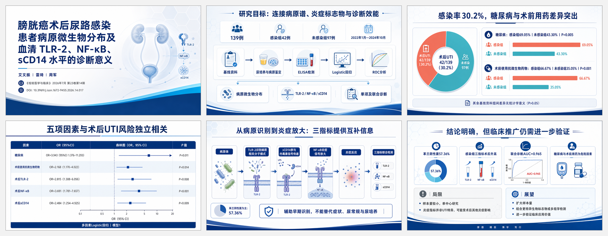

# 小北在读研 · XiaoBei Skills

这里集中维护小北在读研公开的 AI + 科研 Skills。每个 Skill 都放在 `skills/` 下的独立目录中，可以单独发现、安装、调用和更新。

> [!IMPORTANT]
> 这个仓库是 **Skill 合集索引**，根目录故意不放 `SKILL.md`，因此根目录不能作为单个 Skill 安装。若用户只说“安装 `xiaobei-skill`”而没有指定子 Skill，Codex 应先读取 [`skill-catalog.json`](skill-catalog.json)，展示清单并让用户选择；选择后只安装对应子目录。除非用户明确要求，否则不要猜测，也不要一次安装全部 Skills。

## Skill 清单

| 展示名 | 调用名 | 适用任务 | 独立目录 |
|---|---|---|---|
| **小北在读研 · Image to VBA** | `$xiaobei-skill-image-to-vba` | 将学术图、科研示意图、幻灯片或 UI 截图重建为可编辑 Office VBA Shapes | [`skills/xiaobei-skill-image-to-vba`](skills/xiaobei-skill-image-to-vba) |
| **小北在读研 · Academic Paper to PPT** | `$xiaobei-skill-academic-paper-to-ppt` | 将论文、文献、报告或技术文档生成图片式学术答辩 / 项目汇报 PPT | [`skills/xiaobei-skill-academic-paper-to-ppt`](skills/xiaobei-skill-academic-paper-to-ppt) |

内部调用名使用小写英文字母与连字符，保证安装和调用兼容；Codex 界面中的 `display_name` 统一使用“**小北在读研 ·**”作为品牌前缀。

## 推荐安装方式

### 还没有决定安装哪个

把下面这句话交给 Codex：

```text
Use $skill-installer to inspect xiao24bei/xiaobei-skill. List the available child skills with their descriptions, ask me which one I want, and install only my selection.
```

Codex 应先列出当前清单，不直接安装仓库根目录。

### 已经知道要安装哪个

只安装 Image to VBA：

```text
Use $skill-installer to install https://github.com/xiao24bei/xiaobei-skill/tree/main/skills/xiaobei-skill-image-to-vba
```

只安装 Academic Paper to PPT：

```text
Use $skill-installer to install https://github.com/xiao24bei/xiaobei-skill/tree/main/skills/xiaobei-skill-academic-paper-to-ppt
```

安装后可分别调用：

```text
Use $xiaobei-skill-image-to-vba to convert this uploaded academic image into editable Office VBA Shapes code.
```

```text
Use $xiaobei-skill-academic-paper-to-ppt to turn this paper into a thesis-defense presentation.
```

### 手动安装或本地开发

```bash
git clone https://github.com/xiao24bei/xiaobei-skill.git
mkdir -p ~/.codex/skills
ln -s "$(pwd)/xiaobei-skill/skills/xiaobei-skill-image-to-vba" ~/.codex/skills/xiaobei-skill-image-to-vba
```

把最后一个目录替换为 `xiaobei-skill-academic-paper-to-ppt`，即可只链接第二个 Skill。

## 效果展示

### 小北在读研 · Academic Paper to PPT

下面案例由该 Skill 从论文内容生成，共 14 页，包含封面、研究设计、数据图表、机制图、结论与展望。PPT 中每页只有一张完整页面图片，适合直接汇报与跨设备展示。



- [下载完整示例 PPTX](examples/xiaobei-skill-academic-paper-to-ppt/defense_presentation.pptx)
- 示例仅用于展示 Skill 的产出形式；论文署名、DOI 与研究内容归原作者及相关权利人所有。

### 小北在读研 · Image to VBA

“可编辑还原效果”截图中的编辑锚点用于证明页面已重建为可编辑对象，而不是重新贴入一张静态图片。

| 输入原图 | 可编辑还原效果 |
|---|---|
|  |  |
|  |  |

## 仓库结构

```text
xiaobei-skill/
├── AGENTS.md
├── skill-catalog.json
├── assets/
│   ├── contact/
│   └── gallery/
├── examples/
│   └── xiaobei-skill-academic-paper-to-ppt/
├── skills/
│   ├── xiaobei-skill-image-to-vba/
│   │   ├── SKILL.md
│   │   ├── agents/openai.yaml
│   │   ├── requirements.txt
│   │   ├── assets/
│   │   ├── references/
│   │   └── scripts/
│   └── xiaobei-skill-academic-paper-to-ppt/
│       ├── SKILL.md
│       ├── agents/openai.yaml
│       ├── requirements.txt
│       ├── assets/
│       ├── references/
│       └── scripts/
└── scripts/validate_skill_collection.py
```

每个子 Skill 都是自包含安装单元，不依赖仓库根目录的文件才能工作。`skill-catalog.json` 是本仓库的机器可读索引，不是 OpenAI 官方 Skill schema。

## 依赖与校验

按需安装某个 Skill 的脚本依赖：

```bash
python -m pip install -r skills/xiaobei-skill-image-to-vba/requirements.txt
python -m pip install -r skills/xiaobei-skill-academic-paper-to-ppt/requirements.txt
```

校验合集目录、Skill 名称与品牌展示名前缀：

```bash
python scripts/validate_skill_collection.py
```

## 加入科研 AI 交流

大家好，我是**小北在读研**，电子信息专业，长期分享 AI + 科研、科研 Agent、论文阅读、学术绘图、科研自动化和研究生提效方法。

<table>
  <tr>
    <td width="46%" valign="top">
      <h3>和小北一起做 AI + 科研</h3>
      <p>适合硕博生、科研工作者、论文写作者和科研工具爱好者。</p>
      <p><strong>加好友建议备注：</strong><br><code>GitHub + 学校/方向 + 年级</code></p>
    </td>
    <td width="54%" align="center" valign="middle">
      
    </td>
  </tr>
</table>

- 个人学术网站：[xiaobeiai.top](https://xiaobeiai.top)
- 科研 API 中转站：[beiapi.cn](https://beiapi.cn)

## 安全、版权与品牌

- Image to VBA 会生成或辅助运行 VBA 宏；只运行你信任并已经审查的 `.bas` 文件。
- 使用论文图片、截图、商标或用户素材时，请确保拥有相应使用权。
- 本仓库使用 Apache-2.0 License；“小北在读研”“小北”“XiaoBei”等品牌标识不授权用于暗示作者背书、赞助或官方关联。
- 本项目与 Microsoft、WPS、OpenAI 或 Codex 官方没有从属、赞助或背书关系。
